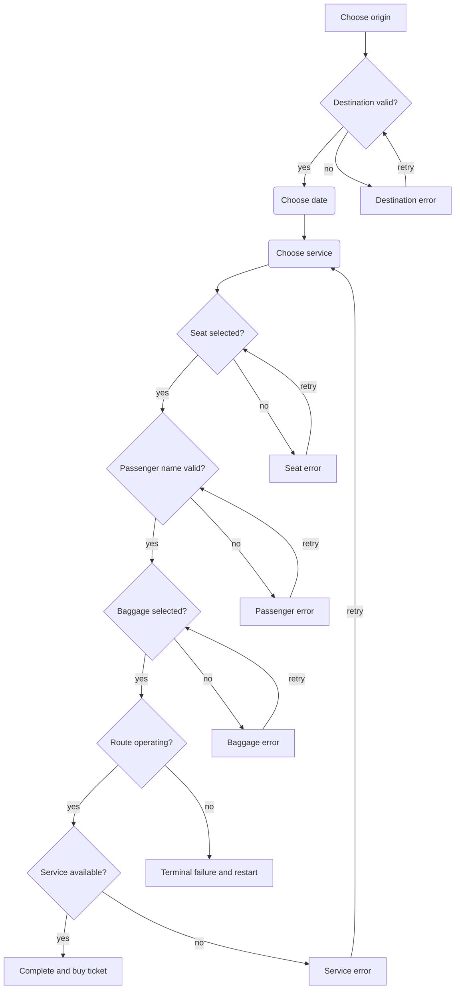

# Prompt Projection Components

A Prompt Projection component turns accumulated user answers into the next
semantic prompt. It is a stateless [Content component](/docs/content-component).
The input and output use `application/x-www-form-urlencoded`.

Use this contract when a browser, terminal, voice interface, or other host must
collect one named answer set at a time. The component validates the complete
input on every render. It does not retain answers in WebAssembly state.

The host owns presentation. The component describes the current prompt with a
small workflow namespace and WAI-ARIA semantics. It does not produce HTML or
terminal control sequences.

## Component Split

Keep prompt projection separate from final content generation. For example, an
email workflow uses two Content components:

```text
application/x-www-form-urlencoded -> application/x-www-form-urlencoded
application/x-www-form-urlencoded -> message/rfc822
```

The first component collects and validates answers. The second component turns
the completed answers into an email message. The final component validates its
input again. Prompt completion is a routing signal, not a trust boundary.

This split keeps every component's input and output content type static. It also
lets a CLI and a browser use the same prompt component without parsing HTML.

## Content Contract

A Prompt Projection component implements all required Content exports. It uses:

- `input_utf8_cap()` for URL-encoded input;
- `output_utf8_cap()` for URL-encoded output;
- `input_content_type_*` with the exact value
  `application/x-www-form-urlencoded`; and
- `output_content_type_*` with the same exact value.

The component must satisfy the static export, memory, repeated-render, and
failure rules in the Content contract.

Each render is independent. Given the same input bytes and uniform values, the
component must return the same projection bytes. A host may use a new component
instance for every render.

## Data Model

The input and output are lists of URL-encoded name-value tuples. Ordinary
top-level names contain user answers:

```text
first_name=Ada&email=ada%40example.com
```

Three decoded root names are reserved for projection metadata:

- `_prompt[...]` describes workflow state and answer binding.
- `_aria[...]` describes the current prompt's semantic role and state.
- `_options[...]` describes an ordered set of choices and its selection limits.

The leading underscore makes protocol data easy to distinguish from ordinary
answers. It does not make the data trusted.

Examples in this document show decoded names such as `_prompt[key]` for
readability. A conforming URL-encoded serializer percent-encodes the brackets:

```text
_prompt%5Bkey%5D=email&_aria%5Brole%5D=textbox
```

### Metadata Name Grammar

A metadata name has one of these decoded forms:

```text
_prompt[property]
_aria[property]
_options[property]
_options[index][property]
```

`property` must be a non-empty lowercase ASCII name. It may contain digits and
hyphens after its first character. An option `index` is a decimal integer. It
has no sign or leading zero, except for index `0`. Option indexes start at zero
and have no gaps. Empty properties, other nested brackets, and unbalanced
brackets are invalid.

These names are invalid:

```text
_prompt
_prompt[]=x
_prompt[key][value]=x
_aria[Label]=x
_options[][label]=Adelaide
_options[01][value]=adelaide
```

The exact roots `_prompt`, `_aria`, and `_options` are reserved. Similar
ordinary names, such as `_promptness`, remain available to applications.

## Projection States

The presence of `_prompt[key]` and `_prompt[error]` defines the projection
state. There is no separate status tuple.

| `_prompt[key]` | `_prompt[error]` | State | Host action |
| --- | --- | --- | --- |
| Present | Absent | Waiting for an answer | Collect the named answer. |
| Present | Present | Recoverable rejection | Report the error and collect a replacement answer. |
| Absent | Present | Terminal failure | Report the error and stop. |
| Absent | Absent | Complete | Pass the ordinary tuples to the next component. |

A waiting projection contains exactly one non-empty `_prompt[key]`. Its value
is the top-level name under which the host stores the next answer. The key is
stable application data. It must name an ordinary top-level answer and must not
depend on a translated label.

A recoverable rejection also contains exactly one non-empty `_prompt[error]`.
The value explains why the current answer was rejected. The component keeps the
same semantic prompt until it accepts a replacement answer.

A terminal failure contains exactly one non-empty `_prompt[error]` and no
`_prompt[key]`, `_aria`, or `_options` tuples. No answer can recover the current
workflow. The host discards the ordinary tuples. It may offer to restart the
workflow with an empty input.

A complete projection contains no `_prompt`, `_aria`, or `_options` tuples.
Its output is plain `application/x-www-form-urlencoded` data and is ready for
the next component.

Any other combination is an invalid projection. In particular, `_aria` or
`_options` tuples without `_prompt[key]` do not indicate completion.

## ARIA Projection

A waiting projection describes one semantic prompt through `_aria[...]`.
It contains:

- exactly one `_aria[role]` with a WAI-ARIA role, such as `textbox`,
  `checkbox`, `combobox`, or `spinbutton`; and
- exactly one non-empty `_aria[label]` with the prompt's accessible name.

It may also contain properties that apply to the role. The initial properties
are:

- `_aria[required]`: `true` or `false` for a prompt without `_options`;
- `_aria[invalid]`: `true` or `false`;
- `_aria[checked]`: `true`, `false`, or `mixed`;
- `_aria[expanded]`: `true` or `false`;
- `_aria[valuemin]`, `_aria[valuemax]`, and `_aria[valuenow]`: decimal
  numbers; and
- `_aria[valuetext]`: a human-readable value.

The component must emit only properties that the role supports. A host must
reject an unknown `_aria` property rather than guess how to present it.

`_aria[role]` is a semantic role. A browser may use a native element or map it
to the HTML `role` attribute. It must not create an `aria-role` attribute.

`_aria[label]` supplies the accessible prompt name. A visual browser host
should normally show the same text in a visible label. A CLI prints it as the
prompt. A voice host may speak it.

Validation text uses `_prompt[error]`. This contract does not use
`aria-errormessage`.

The `_aria` namespace describes only a waiting projection. A complete
projection or terminal failure must not contain `_aria` tuples.

## Option Projection

A waiting projection can contain an ordered set of choices. It contains:

- exactly one `_options[min]` with the minimum number of selections;
- exactly one `_options[max]` with the maximum number of selections; and
- one or more indexed option records.

The minimum and maximum are decimal integers. They satisfy this relation:

```text
0 <= min <= max <= number of option records
```

`max` must be greater than zero.

Each option record contains exactly one non-empty `value` and one non-empty
`label`. It can also contain one non-empty `description`. Values must be
unique. Labels and descriptions can repeat.

```text
_options[min]=1
_options[max]=2
_options[0][value]=quiet-coach
_options[0][label]=Quiet coach
_options[0][description]=Use a carriage with restricted noise.
_options[1][value]=bicycle-space
_options[1][label]=Bicycle space
_options[1][description]=Reserve space for one bicycle.
_options[2][value]=meal
_options[2][label]=Vegetarian meal
```

The option label supplies its accessible name. Keep it short. The description
supplies additional information. A host can show the description or announce
it after the label.

The limits define validation, not presentation. `min=1` means that an answer
is required. Do not also emit `_aria[required]` for an option projection. A
host derives the required state from `min`.

`max=1` permits at most one value. It does not select a presentation by itself.
The role gives the preferred interaction:

| `_aria[role]` | Meaning of `_options` |
| --- | --- |
| `combobox` | The host presents a single-choice popup or suggestions. `max` must be `1`. |
| `radiogroup` | The host presents single-choice radio items. `max` must be `1`. |
| `listbox` | The host presents one or more selectable options. |
| `group` | The host presents a logical group of checkboxes. |

The host infers each child role from the prompt role and the presence of
`_options`. The projection does not declare an option role separately.

For a checkbox group, ARIA does not express "select at least one checkbox" on
the group. A browser host must not apply `aria-required` to every checkbox,
because that would require every choice. It shows the selection rule in the
group label or description and validates the group as one prompt.

The explicit indexes are part of this contract. The URL-encoded format does
not define empty-bracket array grouping. Therefore, a component must not emit
names such as `_options[][label]`.

## User Answer Rules

Prompt Projection collects one answer set per prompt.

- Ordinary answer names are top-level names outside the reserved namespaces.
- A prompt without `_options` produces one tuple.
- An option prompt produces one tuple for each selected value. Every tuple has
  the top-level name from `_prompt[key]`.
- Repeated names express multiple values. Do not add `[]` to the answer name.
- On retry, the host replaces all tuples named by `_prompt[key]`.
- The component validates all answers from the start on every render.
- The component derives the projection shape from validated answers. It never
  accepts caller-provided projection metadata as state.

For example, two ticket extras have this decoded form:

```text
extras=quiet-coach
extras=bicycle-space
```

An option value must not be empty. To submit an empty selection, the host adds
one tuple with an empty value, such as `extras=`. This distinguishes a submitted
empty selection from an answer that the component has not asked for. A
component treats the empty value as zero selections. It rejects the value when
`min` is greater than zero. It removes the empty tuple from completed output.

A scalar answer can be empty. The component decides whether that scalar value
is valid. Therefore, the empty-selection rule applies only to a key that the
component defines as an option answer.

The output contains the complete set of ordinary tuples that the host must
carry into the next render. A component may return a rejected value so the host
can show it again.

When a replacement answer invalidates a later answer, the component removes
the invalid tuple from its next output and returns the affected prompt. It can
keep later answers that remain valid. The host always carries the component's
latest ordinary output, so these removals do not require retained component
state.

The component may normalize an accepted value, such as by removing permitted
outer whitespace. The output value then becomes the canonical value for later
renders and final content generation. Normalization must be deterministic and
documented by the component.

## Host Flow

For an initial prompt, the host calls `render(0)` with an empty input.

After each successful render, the host:

1. Parses the complete URL-encoded output.
2. Rejects malformed metadata, invalid duplicate metadata, and unsupported
   semantics.

If `_prompt[key]` is present, the host:

1. Validates the `_aria` projection.
2. Reports `_prompt[error]` when it is present.
3. Validates `_options` when it is present.
4. Presents the prompt and collects the answer set.
5. Removes all `_prompt`, `_aria`, and `_options` tuples from the carried data.
6. Replaces all top-level tuples named by `_prompt[key]` with the submitted
   values. It uses one empty tuple for an empty option selection.
7. Calls the prompt component again with the complete ordinary tuple list.

If `_prompt[error]` is present without `_prompt[key]`, the host reports the
terminal error, discards the ordinary tuples, and stops.

If no `_prompt`, `_aria`, or `_options` tuples are present, the host passes the
output directly to the next Content component.

The contract does not require one component or system to serve every prompt.
The host may route each turn to a different black box. Each black box receives
ordinary URL-encoded tuples and returns a valid projection. For example, an
application component can validate a passenger name and a timetable system can
check service availability.

The host must not copy projection metadata into hidden controls or other
successful form controls. Caller-supplied `_prompt`, `_aria`, and `_options`
names are invalid input. A component must reject them before it derives
workflow state.

The conditional handoff is host orchestration. It is not an ordinary
unconditional Content pipeline. The host does not run the final component
while `_prompt[key]` is present.

## Train Ticket Example

The examples in this section show one decoded tuple per line. They are not the
wire serialization. A host percent-encodes and joins the tuples with `&` before
it calls the component.

The workflow collects a journey, a train service, a seat, a passenger, and
baggage. It starts with the departure station:

```text
_prompt[key]=origin
_aria[role]=combobox
_aria[label]=Departure station
_options[min]=1
_options[max]=1
_options[0][value]=melbourne
_options[0][label]=Melbourne
_options[1][value]=adelaide
_options[1][label]=Adelaide
```

A selected value is an ordinary top-level tuple. The next projection keeps it
and asks for the destination:

```text
origin=melbourne
_prompt[key]=destination
_aria[role]=combobox
_aria[label]=Destination station
_options[min]=1
_options[max]=1
_options[0][value]=adelaide
_options[0][label]=Adelaide
_options[1][value]=sydney
_options[1][label]=Sydney
_options[2][value]=canberra
_options[2][label]=Canberra
```

The destination component can reject an invalid journey and return the same
prompt. It must return the current options again:

```text
origin=melbourne
destination=melbourne
_prompt[key]=destination
_prompt[error]=The destination must be different from the departure station.
_aria[role]=combobox
_aria[label]=Destination station
_aria[invalid]=true
_options[min]=1
_options[max]=1
_options[0][value]=adelaide
_options[0][label]=Adelaide
_options[1][value]=sydney
_options[1][label]=Sydney
_options[2][value]=canberra
_options[2][label]=Canberra
```

A valid destination advances to the travel date:

```text
origin=melbourne
destination=sydney
_prompt[key]=travel_date
_aria[role]=textbox
_aria[label]=Travel date
_aria[required]=true
```

A timetable system uses the journey and date to offer current services. This
projection prefers a radio group, but another host can use a numbered menu:

```text
origin=melbourne
destination=sydney
travel_date=2026-09-12
_prompt[key]=service
_aria[role]=radiogroup
_aria[label]=Train service
_options[min]=1
_options[max]=1
_options[0][value]=express-0730
_options[0][label]=07:30 express
_options[0][description]=Arrives at 18:42.
_options[1][value]=regional-0815
_options[1][label]=08:15 regional
_options[1][description]=One change; arrives at 20:10.
```

After service selection, the component asks for a seat:

```text
origin=melbourne
destination=sydney
travel_date=2026-09-12
service=express-0730
_prompt[key]=seat
_aria[role]=radiogroup
_aria[label]=Seat
_options[min]=1
_options[max]=1
_options[0][value]=G12
_options[0][label]=Coach G, seat 12
_options[0][description]=Window seat.
_options[1][value]=G13
_options[1][label]=Coach G, seat 13
_options[1][description]=Aisle seat.
```

An empty single-choice answer is a recoverable rejection. The host submits one
empty tuple to show that the user answered without a selection:

```text
origin=melbourne
destination=sydney
travel_date=2026-09-12
service=express-0730
seat=
_prompt[key]=seat
_prompt[error]=You must select a seat.
_aria[role]=radiogroup
_aria[label]=Seat
_aria[invalid]=true
_options[min]=1
_options[max]=1
_options[0][value]=G12
_options[0][label]=Coach G, seat 12
_options[0][description]=Window seat.
_options[1][value]=G13
_options[1][label]=Coach G, seat 13
_options[1][description]=Aisle seat.
```

After seat selection, the component asks for the passenger name. An empty name
is a recoverable rejection:

```text
origin=melbourne
destination=sydney
travel_date=2026-09-12
service=express-0730
seat=G12
passenger_name=
_prompt[key]=passenger_name
_prompt[error]=Passenger name is required.
_aria[role]=textbox
_aria[label]=Passenger name
_aria[required]=true
_aria[invalid]=true
```

An accepted passenger name advances to a required checkbox group. The user
must select one or two baggage types:

```text
origin=melbourne
destination=sydney
travel_date=2026-09-12
service=express-0730
seat=G12
passenger_name=Ada Lovelace
_prompt[key]=baggage
_aria[role]=group
_aria[label]=Baggage
_options[min]=1
_options[max]=2
_options[0][value]=carry-on
_options[0][label]=Carry-on bag
_options[0][description]=Store one small bag in the passenger area.
_options[1][value]=checked-bag
_options[1][label]=Checked bag
_options[1][description]=Store one bag in the luggage car.
_options[2][value]=bicycle
_options[2][label]=Bicycle
_options[2][description]=Reserve space for one bicycle.
```

If the user selects nothing, the host submits `baggage=`. The component returns
the same checkbox group with a recoverable error:

```text
origin=melbourne
destination=sydney
travel_date=2026-09-12
service=express-0730
seat=G12
passenger_name=Ada Lovelace
baggage=
_prompt[key]=baggage
_prompt[error]=You must select baggage.
_aria[role]=group
_aria[label]=Baggage
_aria[invalid]=true
_options[min]=1
_options[max]=2
_options[0][value]=carry-on
_options[0][label]=Carry-on bag
_options[0][description]=Store one small bag in the passenger area.
_options[1][value]=checked-bag
_options[1][label]=Checked bag
_options[1][description]=Store one bag in the luggage car.
_options[2][value]=bicycle
_options[2][label]=Bicycle
_options[2][description]=Reserve space for one bicycle.
```

The workflow has these validation paths. Each recoverable error returns the
named prompt and its current projection.

| Prompt | Condition | `_prompt[error]` |
| --- | --- | --- |
| `origin` | Empty selection | `You must select a departure station.` |
| `destination` | Empty selection | `You must select a destination station.` |
| `destination` | Same as origin | `The destination must be different from the departure station.` |
| `travel_date` | Empty, invalid, or in the past | `Enter a valid future travel date.` |
| `service` | Empty selection | `You must select a train service.` |
| `service` | Service becomes full | `That train is full. Select another service.` |
| `seat` | Empty selection | `You must select a seat.` |
| `seat` | Seat becomes unavailable | `That seat is no longer available. Select another seat.` |
| `passenger_name` | Empty value | `Passenger name is required.` |
| `baggage` | Empty selection | `You must select baggage.` |
| `baggage` | More than two selections | `Select no more than two baggage types.` |
| Workflow | Route suspension | `All services on this route have been suspended. Start a new search.` |

Availability can change while the user answers later prompts. If the selected
train becomes full, the component returns to the service prompt with new
options. This is a recoverable rejection because another answer can continue
the workflow.

```text
origin=melbourne
destination=sydney
travel_date=2026-09-12
service=express-0730
seat=G12
passenger_name=Ada Lovelace
baggage=carry-on
baggage=bicycle
_prompt[key]=service
_prompt[error]=That train is full. Select another service.
_aria[role]=radiogroup
_aria[label]=Train service
_aria[invalid]=true
_options[min]=1
_options[max]=1
_options[0][value]=regional-0815
_options[0][label]=08:15 regional
_options[0][description]=One change; arrives at 20:10.
```

After the host replaces `service`, the component validates `seat` against the
new train. It removes an invalid seat and returns the seat prompt. It can keep
the passenger and baggage answers if they remain valid.

If the operator suspends all services on the route, the component returns a
terminal failure:

```text
origin=melbourne
destination=sydney
travel_date=2026-09-12
service=express-0730
seat=G12
passenger_name=Ada Lovelace
baggage=carry-on
baggage=bicycle
_prompt[error]=All services on this route have been suspended. Start a new search.
```

There is no `_prompt[key]`, `_aria`, or `_options` metadata because no answer
can continue this booking. On success, the output contains only ordinary
tuples:

```text
origin=melbourne
destination=sydney
travel_date=2026-09-12
service=express-0730
seat=G12
passenger_name=Ada Lovelace
baggage=carry-on
baggage=bicycle
```

The host passes the clean output to the ticket-purchase component. That
component checks the service, availability, and current fare again. It must not
trust a price or availability claim carried in ordinary tuples.



## Repository Status

This contract replaces the previous stateful Form ABI. The current `qip form`
command, `<qip-form>` browser element, and modules in `components/form/` still
implement the previous ABI. They do not conform to this contract. Port them
before you use them as Prompt Projection examples.

## CLI Presentation

A CLI host interprets the projection instead of printing its URL-encoded bytes.
For the unavailable service projection above, it may print:

```text
Error: That train is full. Select another service.
Train service:
1. 08:15 regional — One change; arrives at 20:10.
```

When the projection contains no reserved metadata, the CLI sends the output to
the next component. It writes that component's output to stdout.

## Markdown Presentation

A Markdown host can render `_options` as an ordered list. It uses the option
index for order, the label as the main text, and the description as supporting
text:

```markdown
Train service

1. **07:30 express** — Arrives at 18:42.
2. **08:15 regional** — One change; arrives at 20:10.
```

For a checkbox group, it can use task-list notation:

```markdown
Baggage

- [x] **Carry-on bag** — Store one small bag in the passenger area.
- [ ] **Checked bag** — Store one bag in the luggage car.
- [x] **Bicycle** — Reserve space for one bicycle.
```

The human presentation does not need to show an option value. The host submits
the value associated with the selected index.

## Browser Presentation

A browser host selects a suitable native interface from the ARIA projection.
It may use an HTML input, a set of buttons, or another accessible control. The
projection does not require a specific HTML element or attribute set.

For a server-rendered multi-step form, the host puts prior ordinary answers in
hidden controls. Repeated answers use repeated controls with the same ordinary
name. The host does not put `_prompt`, `_aria`, or `_options` metadata in hidden
controls. Every submission therefore reconstructs the complete component input
without retaining a WebAssembly instance.

## Failures

A recoverable user validation failure is a successful render with
`_prompt[key]`, `_prompt[error]`, and `_aria[invalid]=true`. It is not a trap.
An unknown option value, a repeated scalar answer, or a selection count outside
the declared limits is user input validation. The component returns a
recoverable rejection for the affected key.

A terminal failure is also a successful render. It contains `_prompt[error]`
without `_prompt[key]`. It reports an intentional workflow outcome from valid
input. It does not report a component defect.

The component traps on contract failures, including:

- malformed URL encoding;
- invalid UTF-8 after decoding;
- incoming reserved metadata;
- input or output overflow; and
- an internal invariant failure.

The host treats a trap as an execution failure. It must not read partial or
stale output.

## Security And Limits

Hidden controls and URL-encoded output are visible to the user. They are also
editable by the user. Revalidate every ordinary answer in the prompt component
and in the final component.

Do not place authorization decisions, prices, roles, CSRF secrets, or other
server-owned facts in ordinary answer tuples. The component has no application
secret with which to authenticate them.

Do not use this stateless replay model for passwords, payment details, or other
values that should not appear in page markup or repeated requests. Use a host
that owns protected session state instead.

Input grows as the workflow collects answers. Set capacities for the complete
encoded input and the worst-case projection output, including percent encoding.
The host also applies the memory and execution policies in [Hard
Limits](/docs/hard-limits).

Use multipart input or another contract for file content. URL-encoded input is
for small named UTF-8 values, as described in [Formats and
Encodings](/docs/formats).

## When Not To Use This Contract

Do not use Prompt Projection when:

- the component must retain live state that cannot be reconstructed from
  answers;
- several answers must be submitted as one atomic interaction;
- the workflow contains secrets that the client must not replay;
- the input contains files or large binary values; or
- the application needs an ongoing simulation or direct event stream.

Use the Interactive contract for persistent event-driven interfaces. Keep
ordinary application concerns, such as sessions, authorization, and email
delivery, in the host application.
