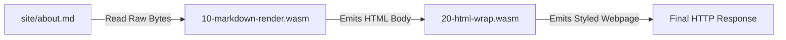

# File Routing and Recipe Orchestration

QIP establishes a deterministic, dual-pass routing and pipeline model where file layouts map directly to canonical URLs and source MIME types determine linear recipe chains. By removing complex framework configuration files, we keep the server lightweight, easily auditable, and completely predictable.

---

## 📂 1. File Discovery & Path Rules

We require content to be stored in clean, well-defined directory structures that map directly to the website's URL hierarchy.

### Skipping Project Directories
* **Claim**: We skip directories named `_recipes`, `_forms`, and `_components` from ordinary content routes.
* **Reason**: This prevents sensitive compiled WebAssembly modules, intermediate pipeline steps, and private layout configurations from being accidentally exposed or served as public static assets.
* **Example**: If a file resides at `site/_recipes/text/markdown/10-render.wasm`, the recursive walk ignores the `_recipes` subtree entirely. A request for `/_recipes/text/markdown/10-render.wasm` will result in a standard `404 Not Found`.

### Path Canonicalization & Safety
To protect the host filesystem and ensure cross-platform compatibility, QIP enforces strict validation criteria during file walking:

* **UTF-8 Integrity**: All relative paths must be valid UTF-8.
* **No Backslashes**: Paths must use forward slashes `/`. Any path containing a backslash `\` is rejected during discovery.
* **No Trailing Dot Segments**: Clean paths must not contain relative directory segments (`.` or `..`).
* **Symlink Loop Protection**: QIP tracks visited absolute paths (`seenDirs`) during recursion to avoid infinite loops on circular symlinks.

---

## 🌐 2. Request Resolution & Pretty Routes

QIP balances user-friendly browser URLs with raw data accessibility by generating multiple routing aliases for specific content files.

### Pretty Routes vs. Raw Source Routes
* **Claim**: We prefer serving pretty URLs (without extensions) for documents, while preserving extension-exact source URLs.
* **Reason**: This gives users and search engines neat, clean page URLs while allowing tools, scrapers, and editors to easily fetch the raw markdown or HTML source for editing or auditing.
* **Example**: A file named `site/about.md` is registered with two route aliases:
  * `/about` (The pretty route, which executes the HTML-rendering recipe chain)
  * `/about.md` (The source route, which bypasses the recipe chain and serves the raw markdown bytes)

### Canonical Routing Table

| Source File | Pretty Route (Processed) | Source Route (Raw) | Content-Type |
| :--- | :--- | :--- | :--- |
| `site/index.md` | `/` | `/index.md` | `text/html` (pretty) / `text/markdown` (raw) |
| `site/docs/index.md` | `/docs` | `/docs/index.md` | `text/html` (pretty) / `text/markdown` (raw) |
| `site/contact.html` | `/contact` | `/contact.html` | `text/html` |
| `site/images/logo.png` | N/A | `/images/logo.png` | `image/png` |
| `site/start.uri` | `/start` | `/start.uri` | `text/uri-list` (Redirect target) |

### Strict Conflict Resolution
* **Claim**: We reject duplicate route assignments at server startup.
* **Reason**: If different source files attempt to register the exact same canonical path, runtime serving becomes non-deterministic. Failing early at build/load time ensures full determinism.
* **Example**: If you have both `site/about.md` and `site/about.html` in the root, the router detects that both want to claim the pretty route `/about`. QIP immediately aborts startup with a compilation error:
  `duplicate route path "/about" for "site/about.html" and "site/about.md"`.

---

## 🧪 3. Recipe Execution Pipeline

Recipes are WebAssembly filters that automatically transform static source files into final webpage responses based on the file's **Source MIME Type**.

### Numeric Order & Sorting
* **Claim**: We execute content recipes sequentially in strict ascending order of their two-digit numeric filenames.
* **Reason**: Sequential numeric ordering ensures deterministic pipeline state transitions without requiring complex dependency charts or external DAG configuration files.
* **Example**: For `text/markdown`, if `site/_recipes/text/markdown/` contains `10-markdown-render.wasm` and `20-html-wrap.wasm`, the markdown-render module runs first (converting raw Markdown to HTML), followed by the wrap module (which wraps the HTML in a template header and footer).

### Prefix Mismatch Prevention
To prevent non-deterministic pipeline ordering, the recipe loader enforces strict filename formats:

* **Format**: Filenames must match `NN-name.wasm` or `-NN-name.wasm` (where `NN` is a two-digit decimal string and `name` contains ASCII alphanumeric characters).
* **Prefix Uniqueness**: No two active recipes within the same MIME directory are allowed to share the same prefix number. If a duplicate prefix is found (e.g., `10-render.wasm` and `10-minify.wasm`), route loading fails instantly.
* **Disabling Recipes**: Prepend a hyphen (`-`) to the numeric prefix (e.g., `-10-render.wasm`) to fully disable the module and exclude it from the pipeline.

---

## ⚡ 4. Dynamic Dev Server & Hot Reloading

The `qip dev` workspace provides immediate feedback by reloading only the modified files without losing server state.

* **Claim**: We scan file timestamps dynamically on browser hard refresh and reload via SIGHUP instead of running background directory pollers.
* **Reason**: This provides absolute determinism and eliminates file-system CPU thrashing in idle states, ensuring we only recompile WASM components when actual, active changes occur.
* **Example**: When the developer edits a recipe and presses `Cmd+Shift+R` (hard refresh), the dev server catches the cache-control headers, detects mismatching file stamps, compiles only the modified modules, and instantly swaps the state.

---

## 📋 5. Decision Rubric & Troubleshooting Checklist

Use this quick checklist to resolve routing and recipe behavior:

- [ ] **My recipe is not running**: 
  - Ensure the recipe file is inside `<recipe-root>/<type>/<subtype>/` where `type/subtype` matches the **Source MIME Type** (e.g., `_recipes/text/markdown/`).
  - Verify the filename begins with a two-digit prefix (e.g., `10-my-recipe.wasm`).
- [ ] **I want to serve raw markdown/HTML instead of running recipes**:
  - Request the exact file path including extension (e.g., `/docs/router.md`).
- [ ] **My pipeline fails with duplicate prefix error**:
  - Check the recipe folder. Ensure no two files start with the same prefix number.
  - Disable one of them by prefixing a hyphen (e.g., `-10-old-recipe.wasm`).
- [ ] **My form component isn't rendering**:
  - Verify that `<qip-form name="contact">` matches a compiled form at `_forms/contact.wasm`.
  - QIP will abort the HTTP request with an error if a form is defined in HTML but is missing from the compiled `_forms` directory.

---

## 🚫 When Not to Use This Model

* Do not use individual content recipes to perform site-wide analytics or link checks. Because content recipes can only see the raw bytes of the current request, they lack global context. Use `application/warc` recipes instead, as they operate over the entire routed site archive.
* Avoid using deep directory structures under `_recipes/` (e.g., `_recipes/text/markdown/subfolder/`). QIP only reads files directly residing in the immediate MIME folder. Nested directories are reserved for future path-scoped recipe selectors and are currently ignored.
